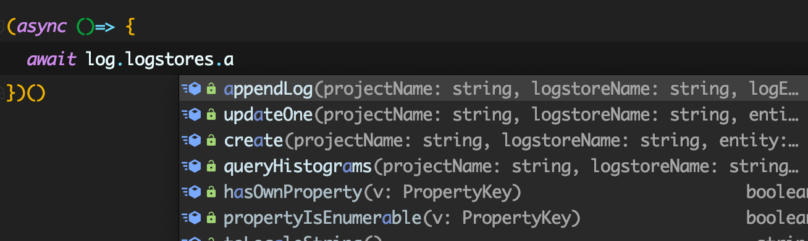

# 快速上手

## 安装

  你可以使用 `npm` 或 `yarn` 安装：
  
  ```bash
  # with npm
  npm i aliyun-logs
  
  # with yarn
  yarn add aliyun-logs
  ```
  
  如果在安装时如果出现网络超时，可以尝试 [npm 淘宝镜像](https://npm.taobao.org/)。

## 使用

  你可以通过 `accessKey` 与 `secret` 创建一个 `Log` 实例 (在 [阿里云用户中心](https://usercenter.console.aliyun.com/#/manage/ak) 获取)，
后续的所有操作都与 `Log` 实例相关。
  
  有关 `endpoint` 你可以查看 [endpoints](https://help.aliyun.com/document_detail/29008.html) 列表，选择相应的阿里云服务 `Region`。
  
  ```js
  const { AliyunLog } = require('aliyun-logs')

  const log = new AliyunLog({
    accessKey: 'your accessKey',
    secret: 'your secret',
    endpoint: 'your endpoint',
  })

  ```
  
  `Log` 实例下包含 `logstores` / `shards` / `projects` / `shippers` / `indexs` 等属性，对应不同的资源，具体请参阅对应的文档。
  
## 类型文件

  `aliyun-logs` 包已经自带了类型文件，如果你的 IDE 或编辑器已有配置，或是你正在使用 `TypeScript`，都可以得到自动的语法提示与错误警告：
  
  
  
## DEBUG

  打开 `debug` 选项会输出更多接口日志。

```js
const log = new AliyunLog({
  accessKey: 'your accessKey',
  secret: 'your secret',
  endpoint: 'your endpoint',
  debug: true,
})
```
